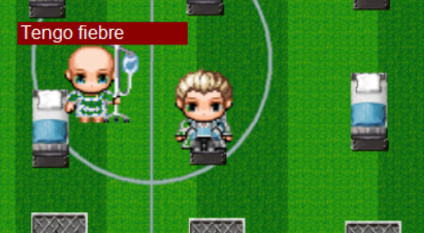
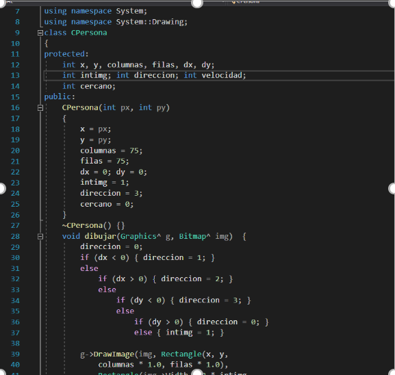
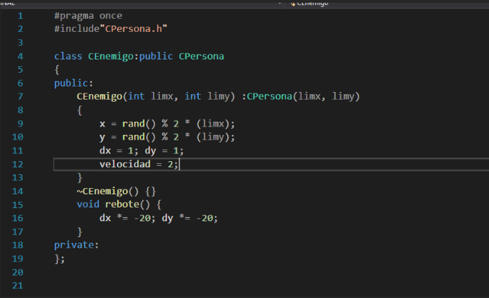
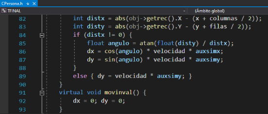
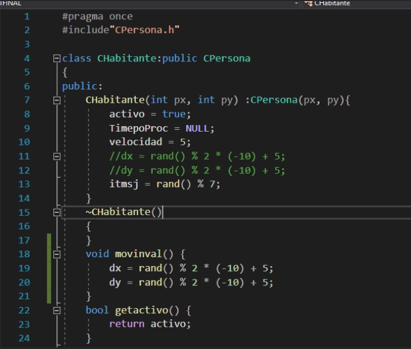
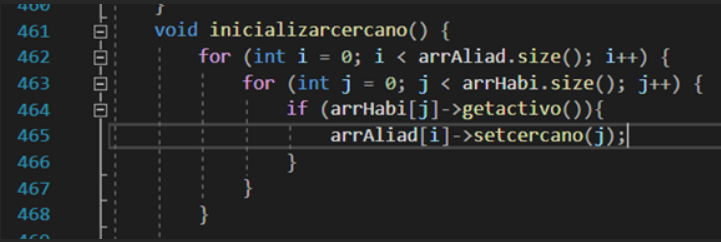
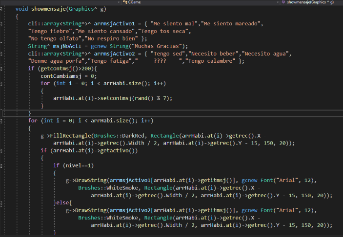

# TF Programming II
 A videogame inspired in Among Us. It is different because of the escenarios and enemies in the map. There are 3 modes inside the game.

 

 
# UPC Logo
 
 
## INFORME DE PARTICIPACIÓN

### Informe que evalúa la competencia de Pensamiento Crítico

#### CURSO DE PROGRAMACIÓN II – CC67
**Carrera de Ciencias de la Computación**

Sección: SV22

**Alumno:**  
U20191E650_Ibrahim Imanol Jordi Arquiñigo Jacinto

Fecha: Junio 2021

---

### CONTENIDO

#### Introducción
El videojuego desarrollado por mi equipo de programación 2 aborda dos problemáticas del mundo real. Por un lado, el primer nivel se basó en el actual contexto de pandemia global del 2020. Es decir, el primer nivel se basa en la problemática de salud, especialmente en Brasil, en el cual se utilizó el estadio de  Maracaná como un hospital de campaña por COVID-19. En este primer nivel, los aliados trataran de ayudar a los pacientes infectados por el virus dándoles vacunas contra este virus. Además, el fondo del videojuego estará ambientado en el estadio de Maracaná como hospital de campaña. Por otro lado, el segundo nivel se basó en el cambio climático, especialmente en el continente africano, en el cual no hay un buen suministro de agua. Es así como, en este segundo nivel, habrá aliados que trataran de dar botellas de agua a los africanos sedientos y el mapa también estará ambientado con una temática de desierto con algunos peces muertos alrededor del mapa. Representando así el cambio climático en África. 

#### Explicación del Trabajo
Mi equipo aplicó el paradigma de Programación Orientada a Objetos, al utilizar clases que definen un conjunto de variables y métodos propios para representar así entidades u objetos. A la vez, se diseñó el trabajo final con sus respectivas interacciones. 

 
En la presente imagen, se puede ver que se hace uso de una clase llamada “CPersona”, en el cual tiene atributos y métodos propios. 

##### 4 principios de Programación Orientada a Objetos:

###### Abstracción:
Se aplico el principio de abstracción porque trabajamos solo con las características esenciales o necesarias del objeto. Sin añadir las características innecesarias. Por ejemplo, podríamos haber puesto en la clase “CPersona” que tenga una variable de tipo string para que me indique que color de pelo tiene esa persona; sin embargo, no lo hicimos. Porque es una variable que no la vamos a utilizar. En cambio, utilizamos una variable de tipo “int” para obtener y guardar el iterador del objeto más cercano hacia otro objeto  con la variable “cercano” (véase la imagen anterior).

###### Encapsulamiento:
Se aplico el principio de encapsulamiento porque la clase padre SOLO está compartiendo sus atributos con sus clases hijas, mas no con la clase controladora. De esta manera nos aseguramos de que haya protección de los atributos de la clase padre y que esta información esté oculta al mundo. (véase la imagen anterior).

###### Herencia:
Se aplico el principio de herencia porque se hizo herencia a las clases hijas que serían en nuestro trabajo final las siguientes: CEnemigo, CAliado, CLider, etc. (véase la imagen siguiente).

 

 
Usando el”: public CPersona” en la línea 4 estamos haciendo herencia de la clase padre a la clase hija que en este caso sería CEnemigo. A la vez le pasamos los valores de CEnemigo a la clase CPersona con el  ” : CPersona (limx, limy)” en la línea 7.De esta manera, nosotros aplicamos herencia en nuestro trabajo final.

###### Polimorfismo:
Se aplico el principio de polimorfismo, porque en la clase padre la función “movinval” esta con un “virtual” en la parte delantera. Eso significa que alguna clase  hija no utilizara esa función, sino que utilizara otra, pero con el mismo nombre. Y de esta manera, la clase CHabitante (clase hija) utiliza su propia función movilval. (vease las siguientes imagenes)

 

(Imagen de la clase padre (CPersona)).

 
De esta manera, podemos decir que hemos utilizado polimorfismo en nuestro trabajo final.

#### Análisis de la Información
Relación de Composición:
[GameForm]++-...*[CGame]
[CGame]1++-7...*[CAliado]
[CGame]1++-7...*[CEnemigo]
[CGame]1++-15...*[CHabitante]
[CGame]1++-1...*[CLider]
[CGame]1++-1...*[CObjetoAlet]
[CGame]1++-1...*[CCreditos]
 
Relación de Asociación:
[CLider]1--7[CAliado]
[CLider]1--15[CHabitante]
 
Herencia:
[CPersona]<>--[CAliado]
[CPersona]<>--[CEnemigo]
[CPersona]<>--[CLider]
[CPersona]<>--[CHabitante]
[CPersona]<>--[CObjetoAlet]

[CPersona]<>--[CCreditos]

...

#### Contexto del Trabajo
Yo encontré más de 2 dificultades en el desarrollo del código del trabajo final, pero solo mencionare las dos más relevantes. Para empezar, la primera dificultad que tuve fue que cada aliado algunas veces se quedaba tratando de ayudar a un habitante que ya ha sido ayudado, pero el aliado no iba a  por otro habitante, sino que  se quedaba con ese mismo habitante todo el rato. Después de revisar  con el automático del Visual Studio para ir recorriendo línea por línea, y gracias a los breakpoints verificando que es lo que estaba pasando, averigüe de que se quedaba algunas veces en el cercano = 0 y no cambiaba el iterator de cercano para que busque a otro habitante que necesitaba ayuda. Luego lo resolví sacando el cercano = 0 e inicializando a los cercanos en los iterators en donde el habitante estaba activo (necesita ayuda), entonces ahora solo los aliados iban a buscar a los habitantes que estaban activos y no a los demás que ya no necesitaban ayuda (los desactivados).

 

 
Para finalizar, la segunda dificultad que tuve fue que quería hacer un listado único para cada nivel y que solo un mensaje de todo el listado aparezca aleatoriamente para cada uno de los habitantes. Este listado contenía mensajes tales como “tengo tos seca” para el nivel 1 y “tengo sed” para el nivel 2. Estos mensajes pertenecían a un arreglo y quería yo guardar el mensaje en una variable de tipo String^ para luego utilizar esto individualmente para cada uno. Lamentablemente, esto no funciono, ya que yo quería un mensaje aleatorio para cada uno de los habitantes con los mensajes únicos para cada nivel. Entonces, pensé en resolverlo, añadiendo o agregando simplemente un iterador para guardar el índice que yo quería usar o que mensaje quiera dar. Este iterador es aleatorio nada más comienza la creación del objJuego, pero luego este mensaje se va renovando a medida de un determinado  tiempo. 

 

  
El “itmsj” es el cual me va a decir en que indice esta el string que voy a utilizar para que cada habitante pueda tener un mensaje. En cambio con la otra solucion, todos tenian el mismo mensaje.
#### Razonamiento
Consume mayor tiempo para implementar (y ¿por qué?)
Según mi experiencia, haber realizado el trabajo final de Programación estructurada (Programación 1) es más difícil de implementar, ya que no se trabajan con clases u objetos con sus propios atributos y métodos. Al no tener estos atributos y/o métodos propios para un objeto, se dificulta el desarrollo, ya que se crean variables algunas veces innecesarias para cambiar las necesarias o para el desarrollo correcto del programa. Además de que estuve durante horas pensando en como hacer un funcionamiento sencillo y fácil de entender en código. En programación 1, todas las variables interactúan entre si y el juego es uno solo. Por lo tanto, hay que pensar en todo momento en si se cambia un factor crucial para el juego, se cambiara todo lo demás y ya no interactuaría de la misma manera. Por estas razones, me pareció más sencillo haber realizado el trabajo final de programación orientada a objetos (programación 2), ya que fue más sencilla la interacción entre estos objetos. Al tener las variables encapsuladas y métodos para acceder a estas, se hace más fácil el cambio de estas variables en la clase controladora. Además de que no se crean variables innecesarias para el desarrollo correcto del programa y solo se crean las necesarias para el trabajo final de la programación orientada a objetos. Inclusive, el desarrollo del videojuego no se ve tan afectado como si lo haría en programación 1. En programación 2, cada objeto tiene maneras de como interactuarían entre otros objetos sin afectar realmente los atributos y/o métodos del objeto interactuado.
Permite mejor comprensión de código para ti (y ¿por qué?) 
Según mi experiencia en haber realizado los trabajos finales de programación 1 y 2.
Pienso que el trabajo de programación 2 permite una mejor comprensión del código, ya que todo está separado por clases y luego se arma en la clase controladora, como su mismo nombre indica; para controlar las funcionalidades del objeto en cuestión. Además de que cada objeto tenga sus propias características y que sean modificables a través de un método exclusivamente para esa funcionalidad. Es decir, las piezas de programación están separadas para que luego todo se una en la clase controladora. Y si llegase a fallar algo, es relativamente mas fácil, ya que no tendrás que pensar en todo el código, sino mas bien en solo esa funcionalidad en específico que está fallando. En cambio, en programación 1, las variables y métodos están al alcance de cualquiera y si falla una función, tendrás que pensar en una a nueva funcionalidad que tampoco afecte demasiado en el código actual. Es decir, si falla algo tendrás que repensar todo el código de principio a fin. Y ver que no este afectando a otra funcionalidad.
Permite mantener un programa con mayor rapidez (y ¿por qué?).
Según mi experiencia en haber realizado los trabajos finales de programación 1 y 2.
Pienso que trabajar con clases y/u objetos, permite un programa con mayor rapidez, porque en programación estructurada (programación 1) por lo menos yo y mi equipo hicimos un código funcional de casi mil líneas para el trabajo final. Pero en programación orientada a objetos podemos hacer lo mismo, pero en menos líneas de código escritas, ya que se estaría trabajando con clases y no tardaríamos tanto en el desarrollo de este.
Por estas razones, yo pienso que, en programación orientada a objetos, es posible mantener un programa con mayor rapidez por el uso de menos líneas de código escritas.

  
#### Conclusión
El trabajo final de programación 2 se ha realizado en base a problemáticas del mundo real, tanto de salud como del cambio climático. A la vez se formuló y se utilizo el paradigma de POO, para el desarrollo del código de programación para el trabajo final del curso. Esta utilización se ha demostrado por usar clases con sus respectivos atributos y métodos propios. Asimismo, se utilizó y se evidencio la utilización de los cuatro principios de POO (Encapsulamiento, Polimorfismo, Abstracción y Herencia) en el trabajo final. El principio de encapsulamiento se demostró por la utilización de la clase padre que compartía sus atributos solo con las clases hijas. A la vez que  se demostró el principio de polimorfismo, ya que había funciones de la clase padre que no siempre utilizaban las clases hijas, sino que utilizaban su propia versión. Asimismo, se demostró el principio de Abstracción, por utilizar solo las funciones necesarias para el funcionamiento del código de programación. También, se demostró el uso del principio de Herencia, ya que utilizamos la clase “CPersona” como clase padre. 
Además, se mostró el diagrama de clases con la cardinalidad y los nombres de las relaciones entre estas clases, y se mostró también los atributos y métodos de cada clase perteneciente a nuestro trabajo final. Para luego, describir 2 dificultades que se han presentado durante el desarrollo del trabajo final. Y como estas se han solucionado gracias al equipo que lo conforma. Para finalizar, se han respondido las preguntas de razonamiento y el porque se estas afirmaciones. 

